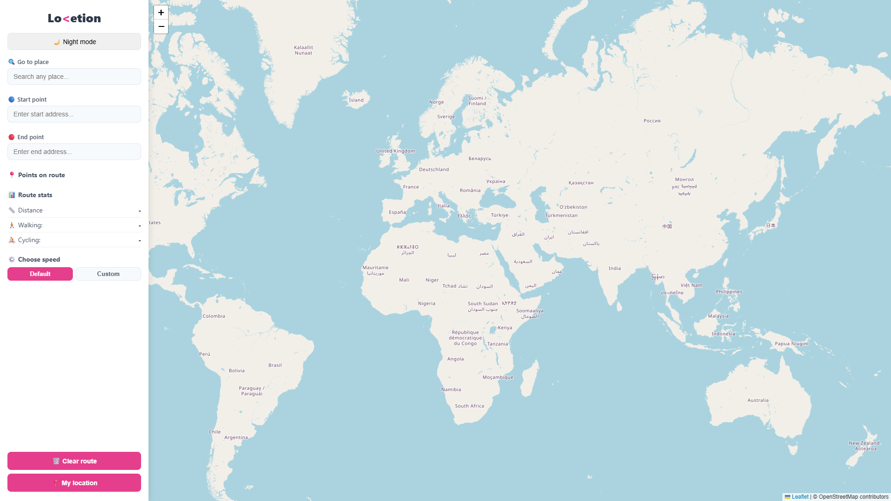
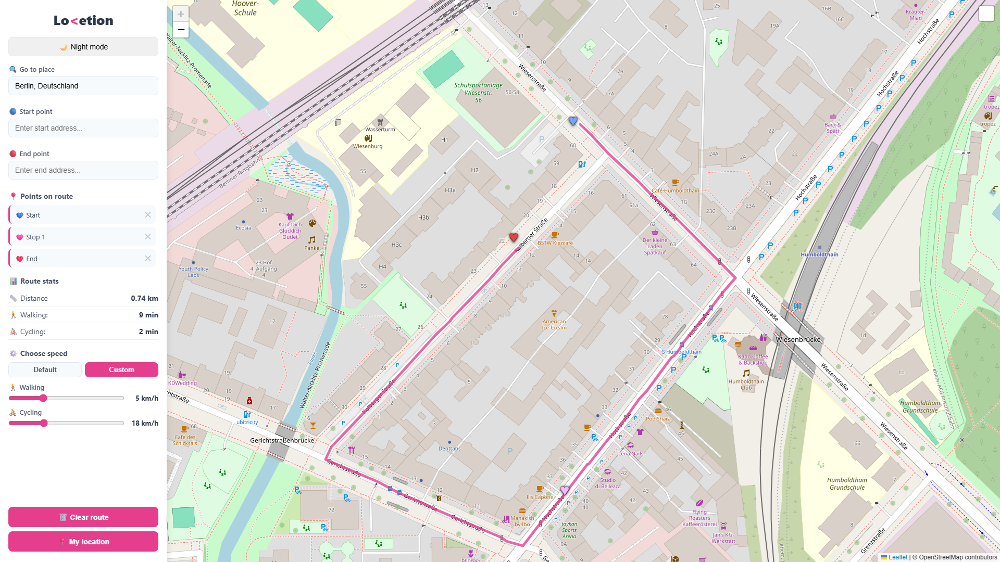
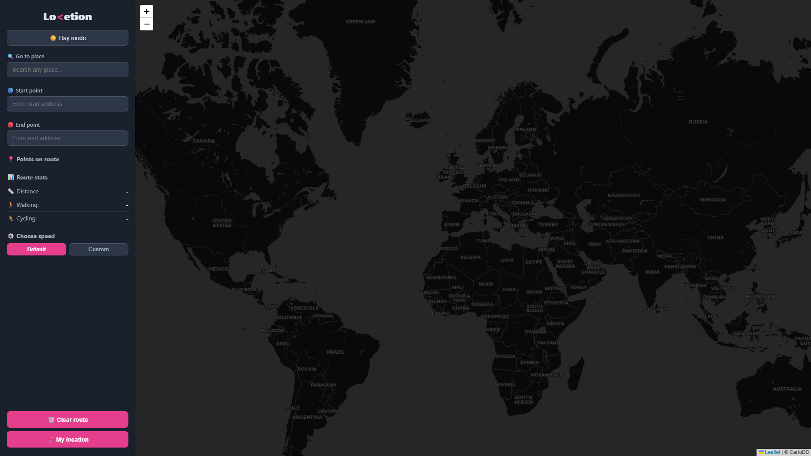

# Lo&lt;etion

An interactive route planning web app built with FastAPI and Leaflet.js — plan walks and bike rides across any city with real street routing, address search, and travel time estimates.

## Overview
Lovetion is a full-stack web application for planning multi-stop routes on foot or by bike.
Users can build a route by clicking directly on the map, searching for addresses, or using
their device's GPS — then instantly see the total distance and estimated travel times.
The app uses OpenStreetMap for map tiles, Nominatim for geocoding, and OSRM for real street routing
(pedestrian profile) — all free, open-source services with no API key required.

## Features
- **Interactive map** — click anywhere to add waypoints, drag markers to adjust
- **Address search** — autocomplete powered by Nominatim geocoding API
- **Real street routing** — the route line follows actual roads and paths via OSRM (pedestrian profile)
- **Go to place** — jump to any location on the map
- **Route statistics** — distance, estimated walking time, and estimated cycling time (cycling time is calculated from the same walked distance using a different average speed, rather than a separate bike-specific route)
- **Custom speed** — adjust walking and cycling speeds with a slider for personalised time estimates
- **Night mode** — toggle between light and dark map themes
- **GPS support** — add your current location as a waypoint with one click
- **Responsive sidebar** — clean panel with point list, stats, and action buttons

## Tech Stack

| Layer | Technology | Purpose |
|-------|-----------|---------|
| Backend | [FastAPI](https://fastapi.tiangolo.com/) | Python web server, `/search` endpoint |
| HTTP client | [httpx](https://www.python-httpx.org/) | Async requests to Nominatim |
| Frontend | Vanilla JavaScript | Map interaction, DOM updates |
| Map library | [Leaflet.js](https://leafletjs.com/) | Interactive map rendering |
| Routing | [Leaflet Routing Machine](https://www.liedman.net/leaflet-routing-machine/) | Turn-by-turn routing plugin |
| Map tiles | [OpenStreetMap](https://www.openstreetmap.org/) / [CartoDB](https://carto.com/) | Day and night tile layers |
| Geocoding | [Nominatim](https://nominatim.org/) | Address → coordinates |
| Routing engine | [OSRM](http://project-osrm.org/) | Coordinates → real street route (foot profile) |
| Templates | Jinja2 | HTML templating |

## Project Structure

```
lovetion-route-planning-app/
├── main.py              # FastAPI app — routes and Nominatim proxy
├── requirements.txt     # Python dependencies
├── static/
│   ├── app.js           # All client-side logic (map, markers, routing, UI)
│   └── style.css        # Styles including dark mode
└── templates/
    └── index.html       # Main HTML template
```

---

## Getting started

### Prerequisites
- Python 3.11 or higher

### Setup
1. Download or clone the project folder.
2. Open the project folder in your IDE (for example PyCharm or VS Code).
3. Install the required dependencies.
```bash
pip install -r requirements.txt
```
4. Start the development server.
```bash
uvicorn main:app --reload
```
5. Open your browser and go to `http://localhost:8000`

## Usage

| Action | How |
|--------|-----|
| Add a waypoint | Click anywhere on the map |
| Move a waypoint | Drag the heart marker |
| Remove a waypoint | Click ✕ next to the point in the sidebar |
| Search for start/end | Type in the Start point or End point fields |
| Jump to a place | Type in the "Go to place" field |
| Use GPS location | Click "My location" |
| Clear everything | Click "Clear route" |
| Toggle night mode | Click "Night mode" / "Day mode" |
| Custom travel speed | Toggle "Custom" under Route stats and adjust sliders |

---

## Images

<p align="center">
   
</p>
<p align="center">
   
</p>
<p align="center">
   
</p>

---

## Acknowledgements
- [OpenStreetMap](https://www.openstreetmap.org/copyright) contributors for map data
- [OSRM](http://project-osrm.org/) for the open routing engine
- [Nominatim](https://nominatim.org/) for geocoding
- [Leaflet](https://leafletjs.com/) and [Leaflet Routing Machine](https://www.liedman.net/leaflet-routing-machine/) for the mapping stack